<h1 align="center">
  
</h1>

<h1 align="center">⚡ Syntrix-AI</h1>

<h3 align="center">Full-Stack AI Agent Platform Generator</h3>

<p align="center">
  <i>An interactive CLI that generates production-ready FastAPI + Next.js projects with AI agents, RAG pipelines, WebSocket streaming, and 20+ enterprise integrations — configured exactly how you want.</i>
</p>

<p align="center">
  <a href="https://pypi.org/project/fastapi-fullstack/"></a>
  <a href="https://github.com/vstorm-co/full-stack-ai-agent-template#readme"></a>
</p>

<p align="center">
  
  
  
  
  
</p>

---

## What It Does

**Syntrix-AI** is a CLI code generator. Run one command, answer a few prompts, and get a complete, production-ready project — wired up and ready to run.

```bash
pip install fastapi-fullstack
fastapi-fullstack
```

<p align="center">
  
</p>

The generated project includes everything you need from day one:

- **FastAPI backend** with async database access, JWT auth, and structured routes
- **AI agent** with WebSocket streaming and conversation persistence
- **RAG pipeline** — upload documents, embed, and query via the agent
- **Next.js 15 frontend** with dark/light mode, i18n, and real-time chat UI
- **Docker Compose** with all infrastructure services pre-configured
- **CI/CD** (GitHub Actions or GitLab CI) ready to push

---

## Preview

<table>
  <tr>
    <td>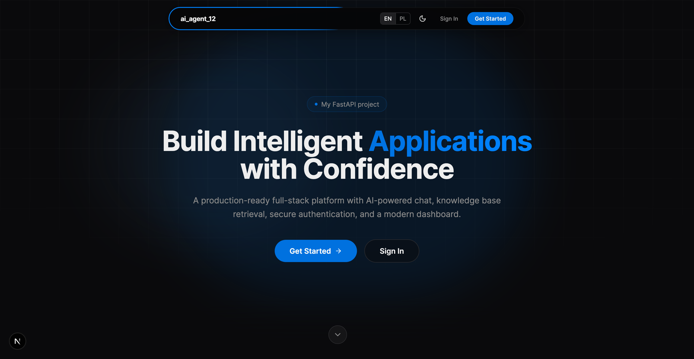</td>
    <td>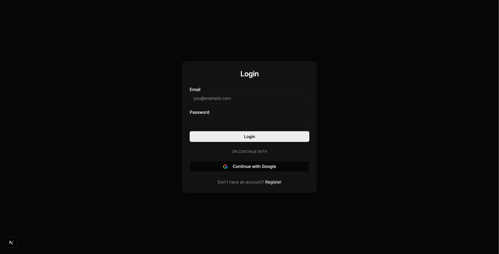</td>
  </tr>
  <tr>
    <td>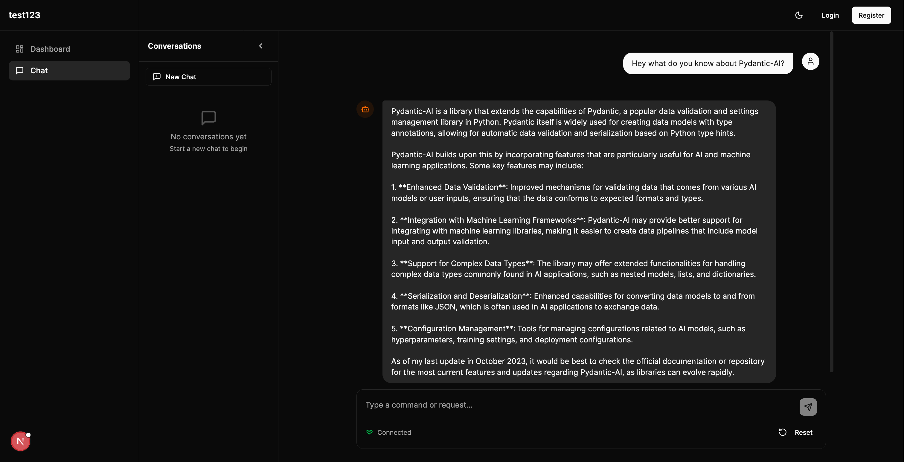</td>
    <td>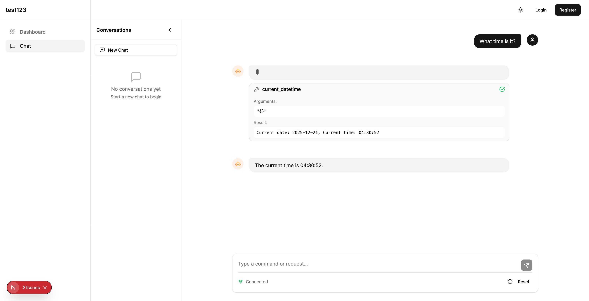</td>
  </tr>
  <tr>
    <td>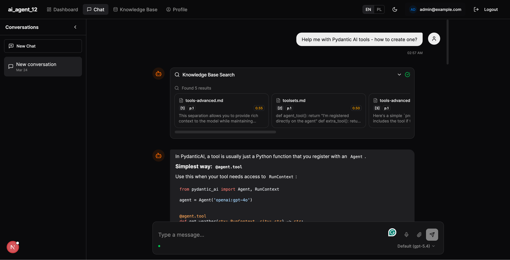</td>
    <td>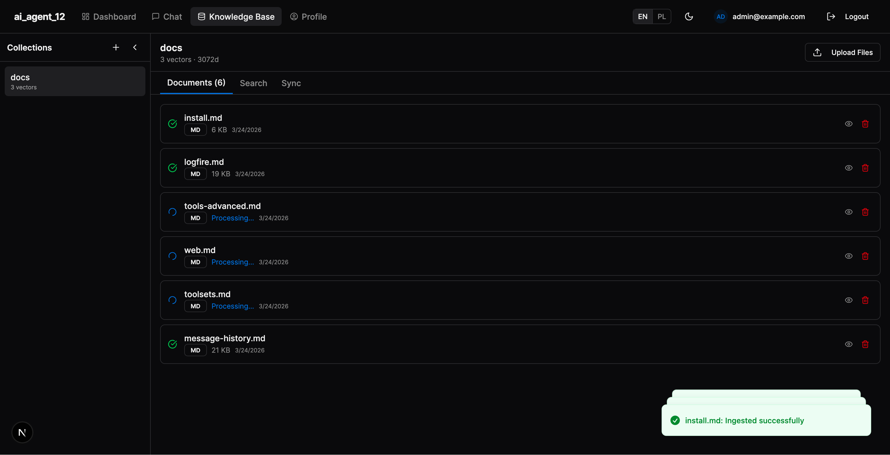</td>
  </tr>
  <tr>
    <td>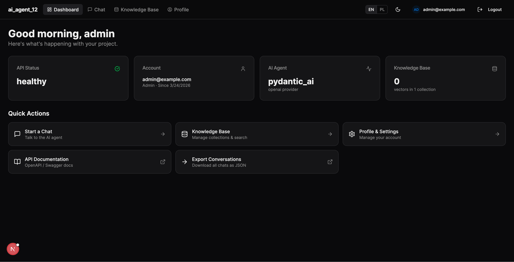</td>
    <td>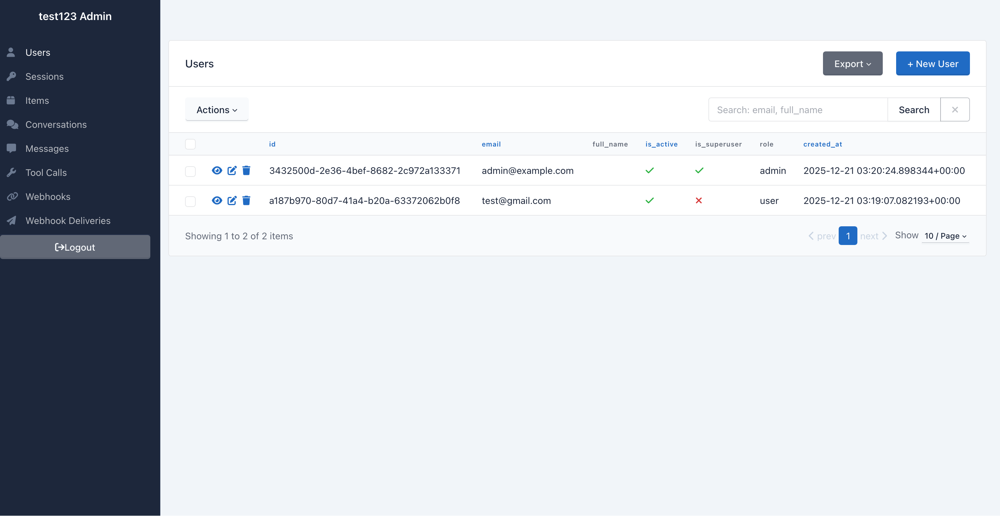</td>
  </tr>
</table>

---

## Installation

```bash
# pip
pip install fastapi-fullstack

# uv (recommended)
uv tool install fastapi-fullstack
```

**Requirements:** Python 3.11+

---

## Quick Start

### Interactive wizard (recommended)

```bash
fastapi-fullstack
```

Walks you through every option step-by-step and shows a summary before generating.

### Direct creation

```bash
# Minimal project
fastapi-fullstack create my_project --database postgresql

# AI agent with RAG
fastapi-fullstack create my_project \
  --ai-framework pydantic_ai \
  --llm-provider anthropic \
  --rag --vector-store qdrant \
  --database postgresql \
  --task-queue celery \
  --frontend nextjs

# Full production setup (one flag)
fastapi-fullstack create my_project --preset production --frontend nextjs

# AI agent preset
fastapi-fullstack create my_project --preset ai-agent --frontend nextjs
```

### List all options

```bash
fastapi-fullstack templates
```

---

## What Gets Generated

```
my_project/
├── backend/
│   ├── app/
│   │   ├── main.py                  # FastAPI app with lifespan
│   │   ├── api/routes/v1/           # Auth, chat, RAG, users endpoints
│   │   ├── core/                    # Config, security, middleware, CORS
│   │   ├── db/                      # SQLAlchemy / MongoDB models & sessions
│   │   ├── schemas/                 # Pydantic request/response models
│   │   ├── repositories/            # Data access layer
│   │   ├── services/                # Business logic
│   │   ├── agents/                  # AI agent (your chosen framework)
│   │   ├── rag/                     # RAG pipeline + sync connectors
│   │   └── worker/                  # Background tasks (Celery/Taskiq/ARQ)
│   ├── alembic/                     # DB migrations (PostgreSQL/SQLite)
│   └── tests/                       # pytest test suite
├── frontend/                        # Next.js 15 App Router (optional)
│   └── src/
│       ├── app/                     # Pages
│       ├── components/              # UI components
│       ├── hooks/                   # useChat, useWebSocket, useAuth
│       └── stores/                  # Zustand state
├── docker-compose.yml
├── Makefile
└── .env                             # Pre-filled environment file
```

---

## Configuration Options

### AI Frameworks

| Framework | Notes |
|-----------|-------|
| `pydantic_ai` | Default. Logfire observability. Supports all 4 LLM providers. |
| `langchain` | LangSmith observability |
| `langgraph` | ReAct agent pattern. LangSmith observability |
| `crewai` | Multi-agent crews |
| `deepagents` | Agentic coding with human-in-the-loop |

### LLM Providers

| Provider | Default model | Embeddings |
|----------|--------------|------------|
| `openai` | gpt-4o-mini | text-embedding-3-small |
| `anthropic` | claude-sonnet-4-5 | voyage-3 |
| `google` | gemini-2.0-flash | gemini-embedding-2-preview (multimodal) |
| `openrouter` | configurable | sentence-transformers (local) |

### Databases & ORMs

| Database | ORM support |
|----------|------------|
| PostgreSQL (async, asyncpg) | SQLAlchemy, SQLModel |
| MongoDB (async, Motor) | ODM included |
| SQLite (sync) | SQLAlchemy, SQLModel |

### RAG Pipeline

| Option | Choices |
|--------|---------|
| Vector store | Milvus, Qdrant, ChromaDB, pgvector |
| PDF parser | PyMuPDF (local), LiteParse (local AI), LlamaParse (cloud, 130+ formats) |
| Reranker | Cohere rerank-v3.5, cross-encoder (local) |
| Document sources | Local upload, Google Drive sync, S3/MinIO sync |

### Background Tasks

| System | Notes |
|--------|-------|
| `celery` | Classic, battle-tested, requires Redis |
| `taskiq` | Async-native, requires Redis |
| `arq` | Lightweight, requires Redis |
| `none` | FastAPI `BackgroundTasks` only |

### Integrations

| Feature | Flag |
|---------|------|
| Redis (caching + sessions) | `--redis` |
| Response caching | `--caching` |
| Rate limiting (memory or Redis) | `--rate-limiting` |
| Admin panel (SQLAdmin) | `--admin-panel` |
| S3/MinIO file storage | `--file-storage` |
| Webhooks | `--webhooks` |
| Google OAuth2 | `--oauth-google` |
| Session management | `--session-management` |
| Web search tool | included in agent |

### Observability

| Tool | When |
|------|------|
| Logfire | PydanticAI (FastAPI, DB, Redis, Celery, httpx instrumentation) |
| LangSmith | LangChain, LangGraph, DeepAgents |
| Sentry | `--sentry` |
| Prometheus | `--prometheus` |
| Celery Flower | auto-included with Celery in Docker |

### Infrastructure

| Option | Choices |
|--------|---------|
| Reverse proxy | Traefik (included or external), Nginx (included or external), none |
| CI/CD | GitHub Actions, GitLab CI |
| Kubernetes | `--kubernetes` (generates manifests) |
| Python version | 3.11, 3.12, 3.13 |
| Frontend brand color | blue, green, red, violet, orange |

---

## Generated API Endpoints

| Method | Endpoint | Description |
|--------|----------|-------------|
| POST | `/api/v1/auth/register` | Register new user |
| POST | `/api/v1/auth/login` | Login, get JWT tokens |
| POST | `/api/v1/auth/refresh` | Refresh access token |
| GET | `/api/v1/chat/conversations` | List conversations |
| POST | `/api/v1/chat/message` | Send message to AI agent |
| WS | `/api/v1/chat/ws` | WebSocket streaming |
| POST | `/api/v1/rag/upload` | Upload document |
| GET | `/api/v1/rag/search` | Search knowledge base |
| GET | `/api/v1/users/me` | Current user profile |

Interactive docs: `/docs` (Swagger UI) · `/redoc`

---

## Running a Generated Project

After generation, start everything with:

```bash
cd my_project
docker-compose up -d
```

| Service | URL |
|---------|-----|
| Frontend | http://localhost:3000 |
| API | http://localhost:8000 |
| API Docs | http://localhost:8000/docs |
| Admin Panel | http://localhost:8000/admin |
| Celery Flower | http://localhost:5555 |

---

## Development (this repo)

```bash
# Install
uv sync

# Run tests
uv run pytest

# Run a single test
uv run pytest tests/test_file.py::test_name -v

# Lint and format
uv run ruff check . --fix
uv run ruff format .

# Type check
uv run ty check
```

---

## Screenshots

<table>
  <tr>
    <td align="center"><b>Logfire observability</b></td>
    <td align="center"><b>LangSmith traces</b></td>
  </tr>
  <tr>
    <td>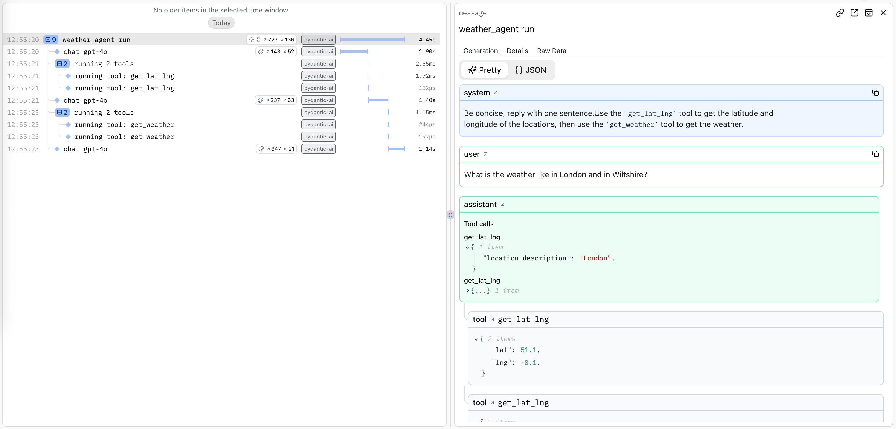</td>
    <td>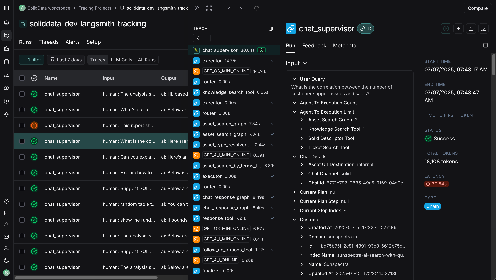</td>
  </tr>
  <tr>
    <td align="center"><b>Celery Flower</b></td>
    <td align="center"><b>RAG search</b></td>
  </tr>
  <tr>
    <td>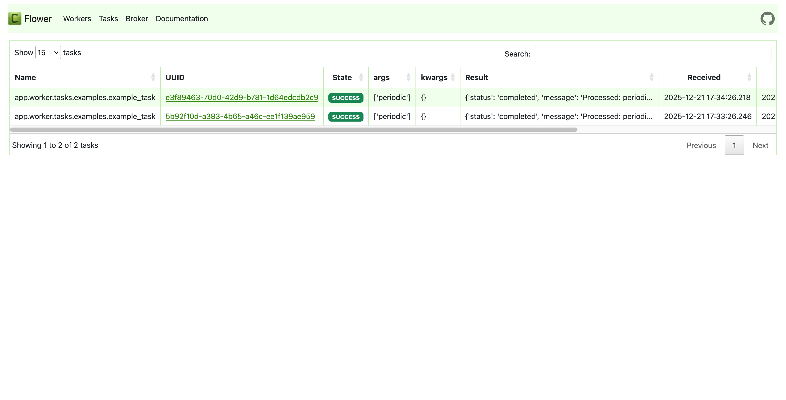</td>
    <td>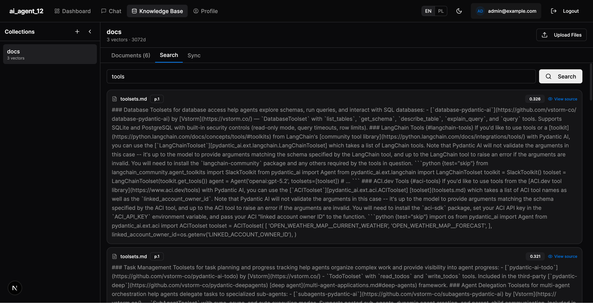</td>
  </tr>
</table>

---

## Contributing

Contributions, issues, and feature requests are welcome. See [CONTRIBUTING.md](./CONTRIBUTING.md) to get started.

---

## License

MIT License — see [LICENSE](./LICENSE) for details.

---

<div align="center">
  <p>Built with ❤️ by <a href="https://github.com/omjaiswal45"><b>Om Jaiswal</b></a></p>
  <p>
    <a href="https://github.com/omjaiswal45">GitHub</a> •
    <a href="https://linkedin.com/in/omjaiswal45">LinkedIn</a>
  </p>
</div>
